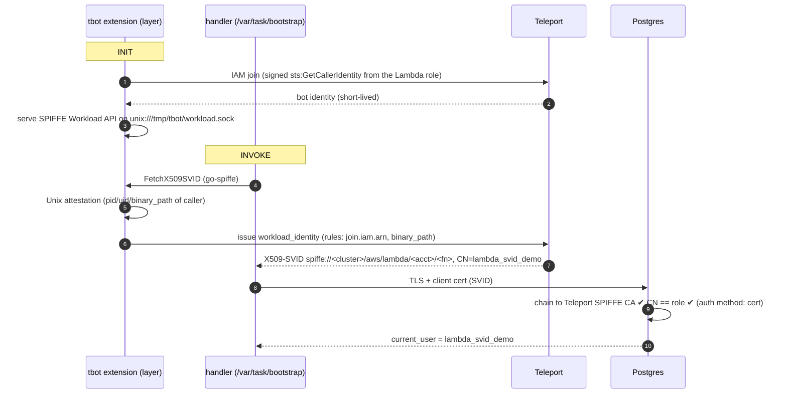

# tbot in AWS Lambda → X509-SVID → passwordless Postgres

A Go Lambda gets a SPIFFE X509-SVID from Teleport Workload Identity and uses it as
its TLS client cert to log in to PostgreSQL. The function has no stored secrets:
no DB password, no Teleport join token secret, no long-lived certs.



## Layout

| Path | What it is |
|---|---|
| `demo-walkthrough.ipynb` | The whole demo as ordered, idempotent notebook cells. **Start here.** |
| `cmd/tbot-extension` | Lambda **external extension**: registers with the Extensions API, writes a tbot config, runs `tbot`, blocks INIT until tbot reports ready, restarts it if it crashes, stops it on SHUTDOWN |
| `cmd/handler` | The function: fetches an SVID with `go-spiffe`, connects to Postgres with `pgx` using the SVID, runs queries, returns JSON |
| `terraform/` | Lambda + layer + IAM role, and Teleport `workload_identity`, `role`, `bot`, IAM `provision_token` |
| `terraform/db/` | An EC2 Postgres host (public subnet, security group, generated SSH key). Separate root module, applied **before** the main one |
| `database/` | Postgres 17 with `cert` auth trusting the Teleport SPIFFE CA: `setup.sh` mints the certs, `deploy-postgres.sh` + `install-postgres.sh` install and configure it over SSH |
| `Makefile` | Downloads `tbot`, builds both zips |
| `requirements.txt` | The notebook's only Python deps: `ipykernel`, `nbconvert` |
| `.env.example` | Template for `.env` — cluster address, region, optional VPC/subnet overrides |

## Prerequisites

Teleport 18.x cluster (Cloud or self-hosted), with `tsh`/`tctl` logged in and rights to manage bots, roles, tokens, and workload identities.

| Tool | Notes |
|---|---|
| `go` 1.24+ | cross-compiles the extension and handler |
| `make` | drives the build; on macOS it comes with `xcode-select --install` |
| `zip` | packages the layer and function |
| `terraform` 1.5+ | provisions the AWS and Teleport resources |
| `aws` | invokes the function, reads logs |
| `tsh` / `tctl` | Teleport session, SPIFFE CA export, provider credentials |
| `ssh`, `openssl` | configures Postgres, inspects certificates |
| `jq` | optional |

Nothing here installs tooling for you. You don't need a Postgres host in advance — `terraform/db` creates one, and `database/install-postgres.sh` configures it from the OS packages over SSH. No container runtime is involved.

> **Why not RDS?** RDS and Aurora Postgres don't support client-certificate authentication. Use a self-managed Postgres (EC2 or on-prem), or another database with X.509 auth (CockroachDB, MongoDB, MySQL `REQUIRE SUBJECT`, etc.).

## Networking: the Lambda has no VPC configuration

This is deliberate, and it's the thing most likely to trip you up if you change it.

**A Lambda ENI never receives a public IP.** So putting the function in a subnet whose default route is an internet gateway gives it *no internet access at all* — only a NAT gateway would, at roughly $32/month. Since tbot must reach your Teleport proxy on 443 during INIT, the function runs with `subnet_ids = []` and talks to Postgres over the instance's public IP.

Postgres is therefore reachable on 5432 from anywhere, which is safe here because `pg_hba.conf` exposes exactly one remotely reachable line — `hostssl demo lambda_svid_demo … cert` — and the role has no password. Without a Teleport-issued client certificate there is no credential to attack.

If you do want the database private, add a NAT gateway and set `subnet_ids` / `security_group_ids`. Those subnets must route `0.0.0.0/0` to the NAT, not to an internet gateway.

## Run it as a notebook

`demo-walkthrough.ipynb` drives the whole demo — prerequisites, network discovery, provisioning the Postgres host, certificates, build, deploy, verification, negative tests, and a gated teardown. Every cell is idempotent: re-running one converges rather than duplicating. It provisions `terraform/db` for you, so you can skip the manual steps below; the rest of this README documents what it automates.

```bash
python3 -m venv .venv
.venv/bin/pip install -r requirements.txt
cp .env.example .env     # then set TELEPORT_PROXY_ADDR
```

The only Python packages needed are `ipykernel` and `nbconvert`. The CLIs above are invoked as subprocesses, so they come from your `PATH`, not the venv.

**PyCharm:** set *Settings → Project → Python Interpreter* to `.venv/bin/python` before opening the notebook. PyCharm's managed Jupyter server runs on the project interpreter, so `ipykernel` has to be installed there — you don't configure the server itself.

**Plain Jupyter:** `.venv/bin/jupyter lab demo-walkthrough.ipynb`, after uncommenting `jupyterlab` in `requirements.txt`. Or register the venv as a named kernel and select it from any Jupyter install:

```bash
.venv/bin/python -m ipykernel install --user --name tbot-svid-demo
```

Step 1 reports whether it's running inside a virtualenv and whether both packages import, so a missing `nbconvert` surfaces there rather than at the export cell after a full provisioning run.

### If you're logged into multiple Teleport proxies

`tsh` and `tctl` follow `~/.tsh/current-profile`, so they may target a cluster you didn't intend. Step 1 pins both explicitly from `.env`:

```bash
export TELEPORT_PROXY=mycluster.teleport.sh:443        # read by tsh
export TELEPORT_AUTH_SERVER=mycluster.teleport.sh:443  # read by tctl
```

**`tctl` ignores `TELEPORT_PROXY`** — it reads `TELEPORT_AUTH_SERVER`. Setting only one pins half the calls, which is worse than not pinning because it looks handled. Use both when running any of these scripts by hand.

The notebook raises if `tctl` can't reach the cluster at all, and warns if the cluster name differs from the proxy hostname — the latter is normal for self-hosted clusters, where `cluster_name` and the proxy DNS name legitimately differ, so it isn't treated as an error.

This matters most for `setup.sh`, which exports the SPIFFE CA that Postgres will trust. Taking that from the wrong cluster produces `certificate verify failed` on every connection, with no other symptom and every piece of configuration still looking correct.

## 1. Database

```bash
cd database
./setup.sh 203.0.113.10                            # the address the Lambda will use
./deploy-postgres.sh 203.0.113.10 ~/.ssh/key.pem   # install + configure over SSH
```

`setup.sh` exports the Teleport SPIFFE CA (`tctl auth export --type tls-spiffe`) into Postgres's `ssl_ca_file`. It also mints a throwaway server CA and cert. `pg_hba.conf` permits only `hostssl … lambda_svid_demo … cert`, so a login needs a cert that chains to Teleport's SPIFFE CA with `CN=lambda_svid_demo`.

`deploy-postgres.sh` copies those files to the host and runs `install-postgres.sh` there as root: it installs `postgresql17-server`, places the certs with `postgres` ownership, sets `ssl` / `ssl_ca_file` / `listen_addresses`, installs `pg_hba.conf`, and creates the database, role, and table. Run `install-postgres.sh` directly with `sudo` if you're already on the host. `PG_MAJOR` and `PGDATA` override the defaults (17 and `/var/lib/pgsql/data`).

Both scripts are re-runnable; every step is guarded.

Two settings that are easy to miss: **`listen_addresses = '*'`** (a stock `initdb` binds localhost only, which from the Lambda looks exactly like a security-group problem) and **`createdb demo`** (`init.sql` creates only the role and table, not the database).

The address has to match the server certificate — `setup.sh` writes an `IP:` SAN for a bare IP and a `DNS:` SAN otherwise, and `db_sslmode = verify-full` checks it. Stop/start an EC2 instance without an Elastic IP and the public IP changes, so re-run both scripts and re-apply.

## 2. Build

```bash
go mod tidy          # first time: resolves go.sum
make                 # arm64; TELEPORT_VERSION defaults to 18.11.2
# make ARCH=amd64    # for x86_64 (then set lambda_architecture = "x86_64")
```

Match `TELEPORT_VERSION` to your cluster's major version — the notebook reads it from the live cluster so the two can't drift.

`build/tbot-layer.zip` lands around 30 MB, under Lambda's **50 MB inline upload limit**. If a future tbot pushes it over, the layer has to be uploaded via S3 rather than inline.

## 3. Deploy

```bash
cd terraform
cp terraform.tfvars.example terraform.tfvars   # edit it
tsh login --proxy=example.teleport.sh
eval "$(tctl terraform env)"                   # short-lived creds for the Teleport provider
terraform init && terraform apply
```

`tctl terraform env` provisions a temporary bot in your cluster with a ~1 hour TTL. That's a write beyond the demo's own resources; the temporary bots expire on their own but show up in `tctl bots instances ls`.

## 4. Run the demo

```bash
$(terraform output -raw invoke_command)
```

```json
{
  "svid": {
    "spiffe_id": "spiffe://example.teleport.sh/aws/lambda/123456789012/tbot-svid-demo",
    "subject": "CN=lambda_svid_demo,O=Teleport Workload Identity Demo",
    "serial": "2df879dbb7c7e2a94c4c8b3ede08707e",
    "issuer": "CN=example.teleport.sh,O=example.teleport.sh",
    "not_before": "2026-09-28T17:02:50Z",
    "not_after": "2026-09-28T18:03:50Z",
    "hint": "postgres-client"
  },
  "database": {
    "current_user": "lambda_svid_demo",
    "server_version": "17.11",
    "ssl_client_dn": "/O=Teleport Workload Identity Demo/CN=lambda_svid_demo",
    "total_invocations_recorded": 1
  },
  "timings_ms": { "fetch_svid": 425, "db_connect": 11, "db_query": 10 }
}
```

`fetch_svid` includes tbot's join on a cold start and drops to roughly half that when warm.

### Talking points / things to show

1. **No secrets anywhere.** The Lambda environment holds only names (proxy, token name, workload identity name) plus a public CA certificate. `sts:GetCallerIdentity` needs no IAM permission, so the execution role carries nothing but basic logging — identity comes from *where the code runs*.
2. **`ssl_client_dn` is the proof.** A populated value means Postgres authenticated a *certificate*. Combined with `current_user = lambda_svid_demo` and a role that has no password, there's nothing else it could have used.
3. **Postgres's own account of it** is more convincing than the function's self-report:
   ```
   connection authorized: user=lambda_svid_demo database=demo
     application_name=tbot-lambda-demo
     SSL enabled (protocol=TLSv1.3, cipher=TLS_AES_256_GCM_SHA384, bits=256)
   ```
4. **Short-lived and per-invoke.** `not_after` is at most 1h out (`svid_ttl`), and every invoke gets a *different* `serial` — nothing is cached.
5. **Teleport audit log.** The bot join event (method `iam`, with the Lambda's assumed-role ARN) and an SVID issuance event per invoke.
6. **Policy on both sides.** Teleport decides *who gets* the identity: `join.iam.arn` and `workload.unix.binary_path` must match. Postgres decides *what it can do*: `GRANT`s to `lambda_svid_demo`. Neither trusts the other's decision.
7. **Negative tests:**
   - `psql "host=<db-host> dbname=demo user=lambda_svid_demo sslmode=require"` fails — no client cert. The Postgres log shows `connection received` with no `connection authorized` following it.
   - Remove the bot's role, or change `svid_common_name`, and the invoke fails.
   - Deploy a second Lambda with another role. Its IAM join is rejected by the token's `aws_arn`.
   - Watch Postgres on the DB host: `sudo tail -f /var/lib/pgsql/data/log/*.log` (`log_connections=on`).

## 5. Teardown

```bash
terraform -chdir=terraform destroy        # Lambda + Teleport resources
terraform -chdir=terraform/db destroy     # EC2, security group, key pair, local .pem
```

The database module destroys the instance and its EBS volume, so the recorded invocations go with it, and the generated SSH key becomes unrecoverable. Your pre-existing VPC, subnet, and internet gateway are never touched. Notebook Step 12 does the same thing behind a `DESTROY = False` gate.

## How the extension behaves

- **INIT:** it registers for `SHUTDOWN` only, so it adds no per-invoke latency. It writes `/tmp/tbot/tbot.yaml` (IAM join, `storage: memory`, one `workload-identity-api` service), starts `/opt/bin/tbot`, then polls tbot's `/readyz` on `127.0.0.1:3001`. Lambda won't send the first invoke until every extension has called `/event/next`, so the handler never races tbot.
- **Freeze/thaw:** tbot is frozen with the sandbox. After a long idle its internal certs may have expired. With IAM join, tbot simply re-joins on its next renewal. The handler fetches a new SVID on every invoke rather than caching one.
- **Failure:** if tbot can't join during INIT, the extension posts `/extension/init/error` and the cold start fails with `Extension.TbotNotReady`. The logs above that line show why (bad ARN, unreachable proxy, etc.).
- **Override:** set `TBOT_CONFIG_PATH` to ship your own tbot config. `TBOT_DEBUG=true` turns on tbot debug logs. Neither is wired into `terraform/aws.tf`'s environment block — add them there if you need them.

## Troubleshooting

| Symptom | Likely cause |
|---|---|
| `Extension.TbotNotReady` on cold start | The Lambda can't reach the proxy. If you added `subnet_ids`, those subnets need a **NAT** gateway — an internet gateway does nothing for a Lambda ENI. Otherwise the token's `aws_arn` doesn't match; compare with `terraform output expected_join_arn`. |
| `permission denied … workload identity` in tbot logs | Workload identity rules didn't match. Try `require_binary_path = false` to check whether Unix attestation is the issue. |
| Postgres: `certificate authentication failed for user` | SVID CN ≠ DB role. Check `svid_common_name` and `ssl_client_dn` in the output. |
| Postgres: `could not accept SSL connection: certificate verify failed` | `ssl_ca_file` isn't the current SPIFFE CA — or it came from a different cluster. Re-run `setup.sh` with `TELEPORT_AUTH_SERVER` pinned. |
| `x509: certificate is valid for …` in the handler | `db_host` doesn't match the server cert SAN. Re-run `setup.sh <exact host>`. |
| Connection timeout to 5432 | `listen_addresses` isn't `*`, or the security group doesn't allow 5432. Both look identical from the Lambda. |
| Cold start > 10s INIT limit | Raise `memory_size` (more CPU), and check network latency to the proxy. |

## Ideas to extend it

- Give **Postgres its own SVID** (tbot on the DB host plus a `workload-identity-x509` output). Then both sides verify each other with SPIFFE and the throwaway server CA goes away.
- Use `workloadapi.X509Source` plus a connection pool to reuse connections across warm invokes, rotating as SVIDs renew.
- Use a **JWT-SVID** to call an HTTP API, or AWS via Roles Anywhere, from the same extension.
- Package the whole thing as a container-image Lambda instead of a layer if you'd rather not deal with the 250 MB unzipped limit.
